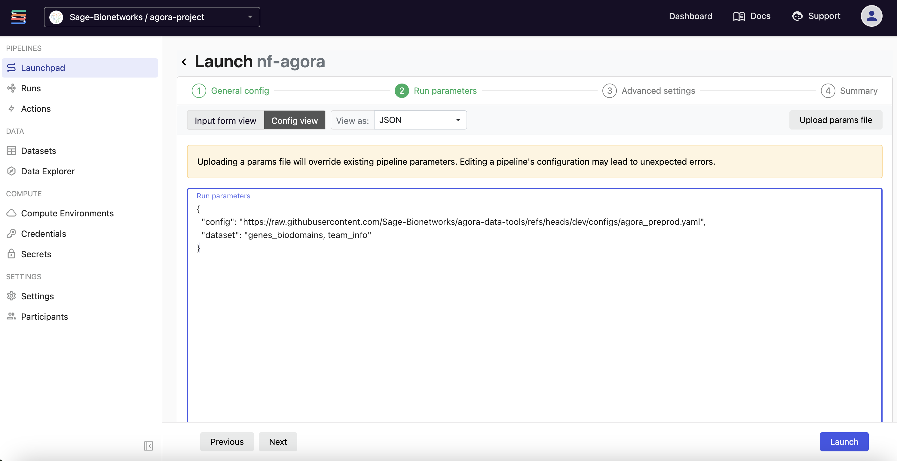
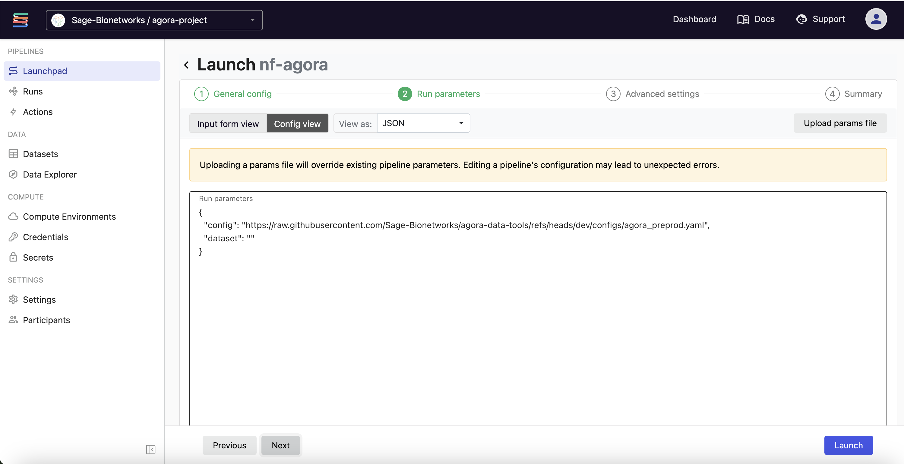

# nf-agora

## Intro

This repository contains a Nextflow Pipeline that wraps agora-data-tools and therefore the Agora ETL process. It is deployed on Sage's Seqera Platform instance, making it simple to trigger and monitor runs. 

## Running the pipeline on Seqera Platform

### Getting Oriented in Seqera Platform

1. Navigate to https://tower.sagebionetworks.org/login.
2. Click "Sign in with Google" and enter your Sage credentials.
3. In the top left corner, you should see "Sage-Bionetworks/agora-project". This indicates that you are in the workspace for Agora in our Seqera Platform instance.
4. If you are not in the correct workspace, click on the drop-down and select "agora-project".

### Launching the Pipeline

For a general overview of the Seqera Platform launch form, see the
[Seqera quickstart guide](https://docs.seqera.io/platform-enterprise/getting-started/quickstart-demo/launch-pipelines).

1. In the "Launchpad" tab, click on the tile labeled "nf-agora".
2. At the top, give your Workflow run a name if you want. If you leave it blank, a randomly generated name will be given to it.
3. Under "General Config > Config profiles", select the appropriate profile:
    - agora_preprod — Agora pre-production run
    - agora_prod — Agora production run
    - model_ad_preprod — Model AD pre-production run
    - model_ad_prod — Model AD production run
4. Optionally, set the dataset parameter to process a specific dataset. If left blank, all datasets in the config will be processed. Supports a single name (e.g. genes_biodomains) or a comma-separated list (e.g. genes_biodomains,team_info).

    The following example uses a comma-separated list:

    

    The following example runs all datasets:

    

5. In the bottom right corner, click "Launch"

### Monitoring your Run

1. Switch to the "Runs" tab near the top of the page. You should see your new run pop up in orange as it is being submitted. When it has been submitted and starts to run, it will turn blue. This may take a few minutes.
2. If the job succeeds it will turn green and if it fails it will turn red.
3. In the event of a failed job, contact DPE and we will look into the issue further.
